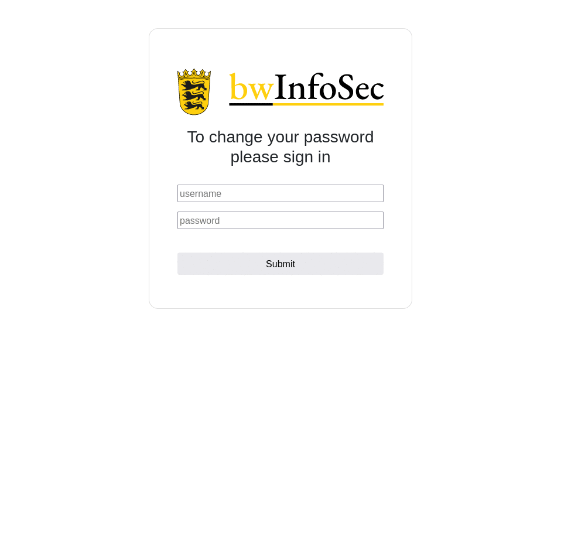

# ldapasswd

This is a minimal go ldap frontend for users to change their password.

**This frontend is intended to run behind a reverse proxy and has no native TLS/SSL support!**

## Licence

The source code of this project is licenced under the EUPL 1.2 but the rights to all images, logos and artwork are restricted.
